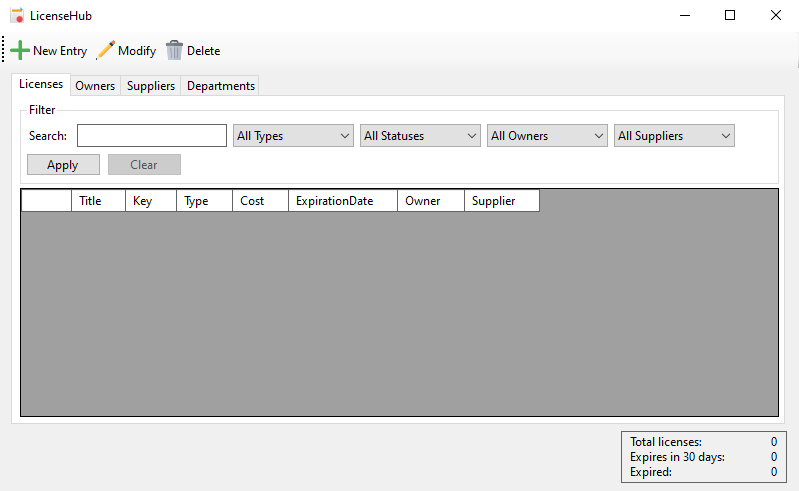

# LicenceHub

A simple WinForms manager for storing and managing licenses or subscriptions

## 🔗 Download

| **Version** | **Link** |
|:---:|:---:|
| Installer (x64/86) | [LicenseHub_installer_x64_x86.exe](https://github.com/petlukdev/LicenseHub/releases/download/v1.0.0/LicenseHub_installer_x64_x86.exe) |
| Standalone EXE (x64) | [LicenseHub_standalone_x64.exe](https://github.com/petlukdev/LicenseHub/releases/download/v1.0.0/LicenseHub_standalone_x64.exe) |
| Portable (x64/86) | [LicenseHub_portable_x64_x86.zip](https://github.com/petlukdev/LicenseHub/releases/download/v1.0.0/LicenseHub_portable_x64_x86.zip) |

📢 **Please note**

- Since this application was developed using Windows Forms technology, it is limited to Windows systems.
- The portable version of the application and the installer **do not include** the required .NET 10 Desktop Runtime. To run the application, download the necessary dependencies from this [link](https://dotnet.microsoft.com/en-us/download/dotnet/10.0).

## 🗃️ Tech stack

## ⚙️ Features

- Adding, editing, and deleting entries in database
- Edit and delete selected entries
- Delete multiple entrie at once
- Filter entities in the database
- License usage statistics
- Color-coded indication of upcoming license expiration
